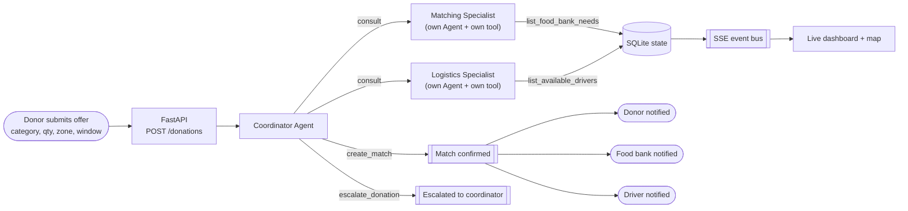

# Food-Rescue Router

An autonomous **multi-agent** system, built on the **Strands Agents SDK** and Amazon
Bedrock, that routes surplus-food donations (from grocers and restaurants) to the food
bank that needs them and a volunteer driver who can carry them there — end to end, with
no human approval step, and only escalating to a human coordinator when no real match
exists. A coordinator agent delegates to two specialist agents (Matching and
Logistics), each independently reasoning over live data, and the result streams live
to a dashboard with a real-time map of the network.

Built for the **Agents for Humans Hackathon** (Good Neighbor track).

## Why this exists

Food-rescue coordination today runs on phone calls and spreadsheets, so good matches
get missed or made too late. This agent is given the same information a human
coordinator would gather — which food banks currently need what, and which drivers
are free and able to carry it — and acts on it directly: it commits to a match (and
notifies the donor, food bank, and driver) or explicitly escalates, every time.

This is a **Good Neighbor** agent, not a personal-productivity tool: every successful
run benefits three separate parties, plus the community the food bank serves.

> **Data note:** the donors, food banks, and drivers in this demo are synthetic —
> fictional stand-ins for a city-scale network, not a real partner organization's
> data. See [docs/architecture.md](docs/architecture.md).

## How it works

1. A donor submits a surplus-food offer (category, quantity, pickup window) through
   the dashboard.
2. A **coordinator agent** consults a **Matching Specialist** (its own Strands `Agent`,
   wrapped as a tool) to pick the best food bank, using live need/capacity data.
3. The coordinator consults a **Logistics Specialist** (same pattern) to pick the best
   driver, using live availability/capacity data for the chosen zone and time window.
4. It reasons about the combined result and either:
   - calls `create_match`, which assigns the donation, marks the driver busy, and
     notifies all three parties, or
   - calls `escalate_donation` with a specific reason, if either specialist found
     nothing viable.
5. The dashboard updates **live** (Server-Sent Events, not polling) — the
   donor/food-bank/driver panels, the activity feed, and an animated route on the map
   all update the instant the agent acts.

## Architecture



Full design, deployment topology, and the standalone AgentCore diagram are in
[docs/architecture.md](docs/architecture.md).

## Features

- **Multi-agent delegation, not one agent with two lookup tools.** The coordinator
  never queries food bank or driver data itself — it consults two separate Strands
  `Agent`s (Matching Specialist, Logistics Specialist), each wrapped as a `@tool`,
  each independently reasoning over live data before answering.
- **Autonomous routing, not a chat interface.** The coordinator's system prompt
  requires consulting both specialists and then always ending by calling
  `create_match` or `escalate_donation` — it cannot just describe what it would do,
  it has to act.
- **Real constraint reasoning.** The Matching Specialist checks need level *and*
  remaining capacity; the Logistics Specialist checks zone *and* vehicle capacity
  *and* availability window against the actual pickup window. The system correctly
  escalates (rather than force a bad match) when, for example, no driver's vehicle
  capacity covers the donation weight.
- **Three-party notification on match.** A confirmed match writes distinct,
  addressed notifications for the donor, the food bank, and the driver — the
  dashboard shows all three updating live, making the multi-party benefit
  (the point of a Good Neighbor agent) visible at a glance.
- **Real-time, not polling.** A server-side SSE stream pushes every activity, match,
  and escalation to the dashboard the instant it happens — including an animated
  route on a live map (real Austin, TX coordinates) showing the donation traveling
  from donor to food bank.
- **Deployed twice, same logic.** The identical coordinator + specialists run both
  in-process in the local dashboard app and standalone on AWS Bedrock AgentCore
  Runtime — see [AgentCore deployment](#agentcore-deployment) below.

## Run it locally

Requires Python 3.12+ and AWS credentials with Amazon Bedrock model access (Claude
Sonnet) in your target region.

```bash
python -m venv .venv
./.venv/Scripts/activate        # or: source .venv/bin/activate on macOS/Linux
pip install -r requirements.txt

python run.py                   # serves the dashboard + API on http://127.0.0.1:8787
```

Open http://127.0.0.1:8787, submit a donation offer, and watch the agent route it.

Environment variables (optional):
- `BEDROCK_MODEL_ID` — defaults to `us.anthropic.claude-sonnet-4-6`
- `AWS_REGION` — defaults to `us-east-1`

## Tests

```bash
python -m pytest tests/
```

Unit tests cover the deterministic parts (seed data, tools, data store). The agent's
reasoning loop is exercised live via the API, since it depends on a real model call.

## Project layout

See [docs/architecture.md](docs/architecture.md) for the full design.

```
src/food_rescue_router/
  agent.py        # Coordinator Agent definition, system prompt, routing entrypoint
  tools.py        # Specialist agents (agents-as-tools) + the two terminal actions
  model.py        # Shared Bedrock model config
  data_store.py   # SQLite access + the SSE event bus
  seed_data.py    # synthetic donors / food banks / drivers (with real coordinates)
  api.py          # FastAPI app (POST /donations, GET /state, GET /events)
frontend/index.html # live dashboard: map, panels, activity feed
```

## AgentCore deployment

`deploy/FoodRescueRouterAgent/` is a standalone AWS Bedrock AgentCore Runtime
deployment of the same agent, tools, and system prompt — **live and deployed**
(`arn:aws:bedrock-agentcore:us-east-1:141353495650:runtime/FoodRescueRouterAgent_FoodRescueRouterAgent-FDKqFqAfP3`).
Verified end to end with a real `agentcore invoke` call. See
[docs/deploy-agentcore.md](docs/deploy-agentcore.md) for how to run it locally or
redeploy it.

## Status

Core agent + API + dashboard working end to end against live Bedrock. Routing
agent also deployed standalone to AWS Bedrock AgentCore Runtime and verified live.
Demo video not yet done — see the hackathon build plan.

## License

MIT — see [LICENSE](LICENSE).
