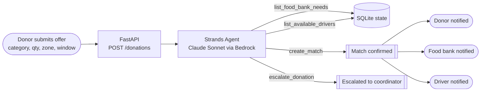

# Food-Rescue Router

An autonomous agent, built on the **Strands Agents SDK** and Amazon Bedrock, that
routes surplus-food donations (from grocers and restaurants) to the food bank that
needs them and a volunteer driver who can carry them there — end to end, with no
human approval step, and only escalating to a human coordinator when no real match
exists.

Built for the **Agents for Humans Hackathon** (Good Neighbor track).

## Why this exists

Food-rescue coordination today runs on phone calls and spreadsheets, so good matches
get missed or made too late. This agent is given the same information a human
coordinator would gather — which food banks currently need what, and which drivers
are free and able to carry it — and acts on it directly: it commits to a match (and
notifies the donor, food bank, and driver) or explicitly escalates, every time.

This is a **Good Neighbor** agent, not a personal-productivity tool: every successful
run benefits three separate parties, plus the community the food bank serves.

> **Data note:** the donors, food banks, and drivers in this demo are synthetic —
> fictional stand-ins for a city-scale network, not a real partner organization's
> data. See [docs/architecture.md](docs/architecture.md).

## How it works

1. A donor submits a surplus-food offer (category, quantity, pickup window) through
   the dashboard.
2. The agent looks up real-time food bank need levels and driver availability using
   its own tools (`list_food_bank_needs`, `list_available_drivers`).
3. It reasons about the best fit and either:
   - calls `create_match`, which assigns the donation, marks the driver busy, and
     notifies all three parties, or
   - calls `escalate_donation` with a specific reason, if nothing viable exists.
4. The dashboard polls live and shows the donor/food-bank/driver views updating, plus
   a feed of everything the agent just did.

## Architecture



Full design, deployment topology, and the standalone AgentCore diagram are in
[docs/architecture.md](docs/architecture.md).

## Features

- **Autonomous routing, not a chat interface.** The agent is given real tools
  (`list_food_bank_needs`, `list_available_drivers`) and two terminal actions
  (`create_match`, `escalate_donation`), and its system prompt requires it to
  always end by calling one of the two — it cannot just describe what it would
  do, it has to act.
- **Real constraint reasoning.** The agent checks food bank need level *and*
  remaining capacity, driver zone *and* vehicle capacity *and* availability
  window against the donation's actual pickup window — not a single lookup.
  It correctly escalates (rather than force a bad match) when, for example, no
  driver's vehicle capacity covers the donation weight.
- **Three-party notification on match.** A confirmed match writes distinct,
  addressed notifications for the donor, the food bank, and the driver — the
  dashboard shows all three updating live, making the multi-party benefit
  (the point of a Good Neighbor agent) visible at a glance.
- **Live activity feed.** Every tool call and decision the agent makes is
  logged and streamed to the dashboard as it happens.
- **Deployed twice, same logic.** The identical agent, tools, and system
  prompt run both in-process in the local dashboard app and standalone on AWS
  Bedrock AgentCore Runtime — see [AgentCore deployment](#agentcore-deployment)
  below.

## Run it locally

Requires Python 3.12+ and AWS credentials with Amazon Bedrock model access (Claude
Sonnet) in your target region.

```bash
python -m venv .venv
./.venv/Scripts/activate        # or: source .venv/bin/activate on macOS/Linux
pip install -r requirements.txt

python run.py                   # serves the dashboard + API on http://127.0.0.1:8787
```

Open http://127.0.0.1:8787, submit a donation offer, and watch the agent route it.

Environment variables (optional):
- `BEDROCK_MODEL_ID` — defaults to `us.anthropic.claude-sonnet-4-6`
- `AWS_REGION` — defaults to `us-east-1`

## Tests

```bash
python -m pytest tests/
```

Unit tests cover the deterministic parts (seed data, tools, data store). The agent's
reasoning loop is exercised live via the API, since it depends on a real model call.

## Project layout

See [docs/architecture.md](docs/architecture.md) for the full design.

```
src/food_rescue_router/
  agent.py        # Strands Agent definition, system prompt, routing entrypoint
  tools.py         # @tool functions: lookups + the two terminal actions
  data_store.py    # SQLite access
  seed_data.py     # synthetic donors / food banks / drivers
  api.py           # FastAPI app (POST /donations, GET /state)
frontend/index.html # live dashboard
```

## AgentCore deployment

`deploy/FoodRescueRouterAgent/` is a standalone AWS Bedrock AgentCore Runtime
deployment of the same agent, tools, and system prompt — **live and deployed**
(`arn:aws:bedrock-agentcore:us-east-1:141353495650:runtime/FoodRescueRouterAgent_FoodRescueRouterAgent-FDKqFqAfP3`).
Verified end to end with a real `agentcore invoke` call. See
[docs/deploy-agentcore.md](docs/deploy-agentcore.md) for how to run it locally or
redeploy it.

## Status

Core agent + API + dashboard working end to end against live Bedrock. Routing
agent also deployed standalone to AWS Bedrock AgentCore Runtime and verified live.
Demo video not yet done — see the hackathon build plan.

## License

MIT — see [LICENSE](LICENSE).
