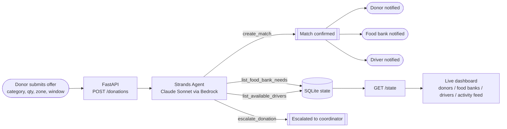
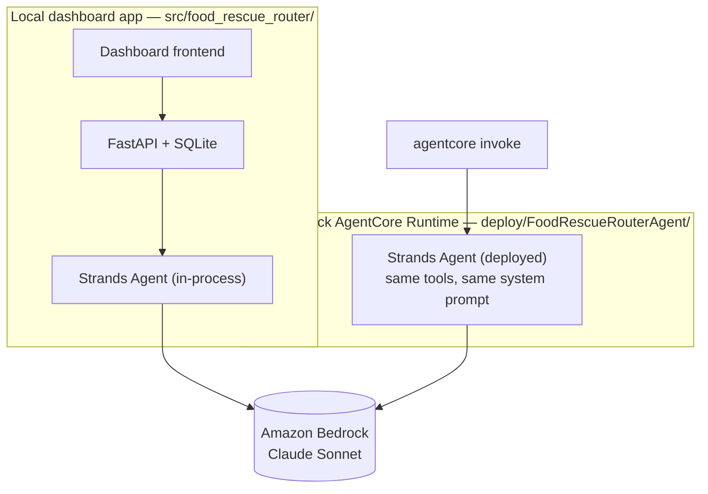

# Architecture

## Problem

Surplus food from grocers and restaurants goes to waste because matching it to a food
bank with real need, and a volunteer driver who can move it before it expires, is
normally done by an overworked human coordinator on the phone and in spreadsheets.
Good matches get missed or made too late.

## Who this is for

A city-scale food-rescue coordinating network (the kind of role organizations like
food rescue alliances or community food-bank networks already fill) — specifically
the **donor** (grocer/restaurant), the **food bank**, and the **volunteer driver**,
three distinct parties who all benefit when a donation is routed well. This is a
**Good Neighbor Agent**: the win is measured at the community/network level, not one
person's productivity.

> This build uses a synthetic-but-realistic dataset (fictional donors, food banks,
> and drivers) rather than a real partner org's data — there is no live data source
> wired in yet.

## Autonomous flow

The agent is given both lookup tools up front and two terminal action tools
(`create_match`, `escalate_donation`). Its system prompt requires it to always end by
calling one of the two action tools — it cannot just describe what it would do. Every
tool call is a real read or write against shared SQLite state, and `create_match`
writes three distinct notifications (one per party) to an activity log that the
dashboard polls live.

## Components

| Component | Tech | File |
|---|---|---|
| Agent + tools | Strands Agents SDK, Amazon Bedrock (Claude) | `src/food_rescue_router/agent.py`, `tools.py` |
| State | SQLite | `src/food_rescue_router/data_store.py` |
| Synthetic seed data | Python | `src/food_rescue_router/seed_data.py` |
| API | FastAPI | `src/food_rescue_router/api.py` |
| Dashboard | Vanilla HTML/JS + Tailwind (CDN) | `frontend/index.html` |

`POST /donations` accepts a new offer, persists it, and synchronously runs the agent
to completion (typically a few seconds). `GET /state` returns everything the
dashboard needs, polled every few seconds so the three-party views and the live
agent activity feed update without a page reload.

## Model

`strands.models.BedrockModel` pointed at a Claude Sonnet inference profile
(`us.anthropic.claude-sonnet-4-6` by default, configurable via `BEDROCK_MODEL_ID`)
in `us-east-1` (configurable via `AWS_REGION`). Requires AWS credentials with Bedrock
model access.

## Deployment topology

The routing agent exists in two places, sharing the same tools and system prompt:
the local dashboard app calls it in-process, and it's also deployed standalone to
AWS Bedrock AgentCore Runtime, invokable independently of the dashboard.

See [docs/deploy-agentcore.md](deploy-agentcore.md) for the live runtime ARN and how
to redeploy.
