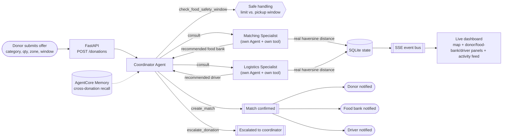
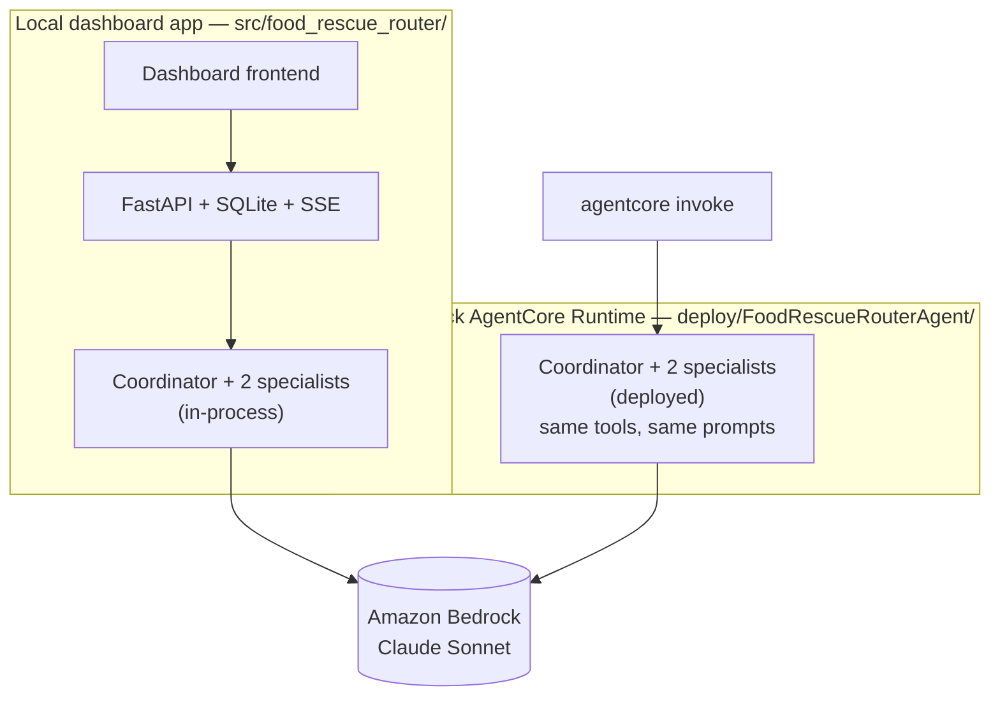

# Architecture

## Problem

Surplus food from grocers and restaurants goes to waste because matching it to a food
bank with real need, and a volunteer driver who can move it before it expires, is
normally done by an overworked human coordinator on the phone and in spreadsheets.
Good matches get missed or made too late.

## Who this is for

A city-scale food-rescue coordinating network (the kind of role organizations like
food rescue alliances or community food-bank networks already fill) — specifically
the **donor** (grocer/restaurant), the **food bank**, and the **volunteer driver**,
three distinct parties who all benefit when a donation is routed well. This is a
**Good Neighbor Agent**: the win is measured at the community/network level, not one
person's productivity.

> This build uses a synthetic-but-realistic dataset (fictional donors, food banks,
> and drivers) rather than a real partner org's data — there is no live data source
> wired in yet.

## Autonomous flow — multi-agent delegation

The routing logic is a **coordinator agent that delegates to two specialist agents**,
each a separate Strands `Agent` wrapped as a `@tool` (the "agents-as-tools" pattern) —
not one agent calling two lookup functions. The coordinator never queries food bank or
driver data itself; it asks a specialist, who independently reasons over live data and
answers.

The coordinator's system prompt requires checking the food-safety window and
consulting both specialists before ever calling `create_match` or `escalate_donation`
— it cannot skip straight to a decision, and it must always end by calling one of
those two terminal actions. Every tool call (the safety check, the specialists'
lookups, and the coordinator's final action) is a real read or write against shared
SQLite state. `create_match` writes three distinct notifications (one per party) and
publishes to the SSE event bus, which pushes the update to the dashboard the instant
it happens.

**Real constraint reasoning, not zone labels.** The Matching and Logistics
Specialists rank food banks and drivers by actual great-circle distance
(`haversine_miles` in `geo.py`) from real Austin, TX coordinates, not a coarse
zone-name match. `check_food_safety_window` (`tools.py`) compares the donation's
pickup window against a per-category safe-handling limit (e.g. dairy and prepared
meals tolerate far less time than produce or bakery) and flags it as its own
consideration alongside distance and capacity — a donation can be geographically
perfect and still get escalated if it would sit too long before pickup.

**Cross-donation memory.** The coordinator is backed by a real Bedrock AgentCore
Memory resource (`memory.py`, via `AgentCoreMemorySessionManager`), not a hand-rolled
cache. If a driver or food bank it just committed to another load moments ago comes up
again, it notices — e.g. correctly setting aside a driver already assigned to an
earlier donation in the same session rather than double-booking them. Memory is
provisioned once and reused by name; if it can't be provisioned (e.g. missing IAM
permission), the coordinator degrades gracefully to routing without cross-donation
recall rather than failing.

## Components

| Component | Tech | File |
|---|---|---|
| Coordinator + specialist agents | Strands Agents SDK (agents-as-tools), Amazon Bedrock (Claude) | `src/food_rescue_router/agent.py`, `tools.py`, `model.py` |
| Real distance + food-safety reasoning | Haversine great-circle distance, per-category safe-handling limits | `src/food_rescue_router/geo.py`, `tools.py` |
| Cross-donation memory | Bedrock AgentCore Memory (`AgentCoreMemorySessionManager`) | `src/food_rescue_router/memory.py` |
| State + live event bus | SQLite, asyncio pub/sub | `src/food_rescue_router/data_store.py` |
| Synthetic seed data (with real Austin, TX coordinates) | Python | `src/food_rescue_router/seed_data.py` |
| API | FastAPI (`POST /donations`, `GET /state`, `GET /events` SSE, `GET /config`) | `src/food_rescue_router/api.py` |
| Dashboard | Vanilla HTML/JS, Leaflet map, marked.js + DOMPurify | `frontend/index.html`, `windfall-map.js` |

`POST /donations` accepts a new offer, persists it, and synchronously runs the
coordinator to completion. `GET /state` returns the full current state for the
dashboard's initial load; after that, `GET /events` (Server-Sent Events) pushes every
activity/match/escalation the instant it happens, so the donor/food-bank/driver panels,
the activity feed, and the map's route animation update live instead of waiting on a
poll interval. A 15-second poll remains as a fallback in case the SSE connection drops.
The public deployment also auto-resets its shared SQLite state on a timer
(`AUTO_RESET_MINUTES`, default 20, `0` disables it) so a no-login public demo link
stays clean for the next visitor without a manual reset control in the UI.

### Dashboard: theming, accessibility, optional sign-in

- **Dark mode** is CSS-variable-driven (`--color-bg`, `--color-text`, etc., redefined
  under both a `prefers-color-scheme: dark` media query and an explicit
  `data-theme="dark"` override), with a header toggle that persists to `localStorage`.
  Users who never touch the toggle get the system default; the Leaflet map's tile
  filter and controls re-theme along with the page.
- **Accessibility**: the donation dialog is a real modal (`role="dialog"`,
  `aria-modal`, a focus trap, Escape-to-close, focus restored to the triggering
  button on close); the Coordinator panel and activity feed are `aria-live` regions
  so screen readers hear updates as they stream in; form labels are properly
  associated via `for`/`id`; `prefers-reduced-motion` is respected.
- **Optional sign-in** (`GET /config`, gated behind `SUPABASE_URL`/`SUPABASE_ANON_KEY`
  being set) uses Supabase's email magic-link auth to unlock a "mine only" filter on
  the ledger — nothing else in the app requires it, so a judge or first-time visitor
  never hits a login wall. With neither env var set, the sign-in UI and all Supabase
  code paths stay entirely inert.

## Model

`strands.models.BedrockModel` pointed at a Claude Sonnet inference profile
(`us.anthropic.claude-sonnet-4-6` by default, configurable via `BEDROCK_MODEL_ID`)
in `us-east-1` (configurable via `AWS_REGION`). Requires AWS credentials with Bedrock
model access.

## Deployment topology

The same multi-agent system (coordinator + Matching Specialist + Logistics
Specialist) exists in two places, sharing identical tools and prompts: the local
dashboard app calls it in-process, and it's also deployed standalone to AWS Bedrock
AgentCore Runtime, invokable independently of the dashboard.

See [docs/deploy-agentcore.md](deploy-agentcore.md) for the live runtime ARN and how
to redeploy.
