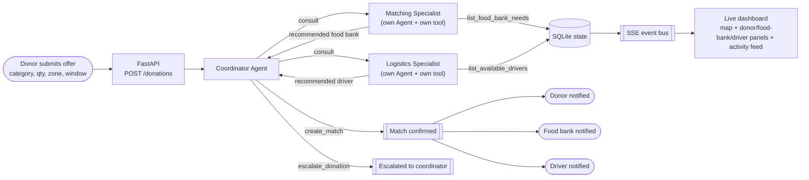
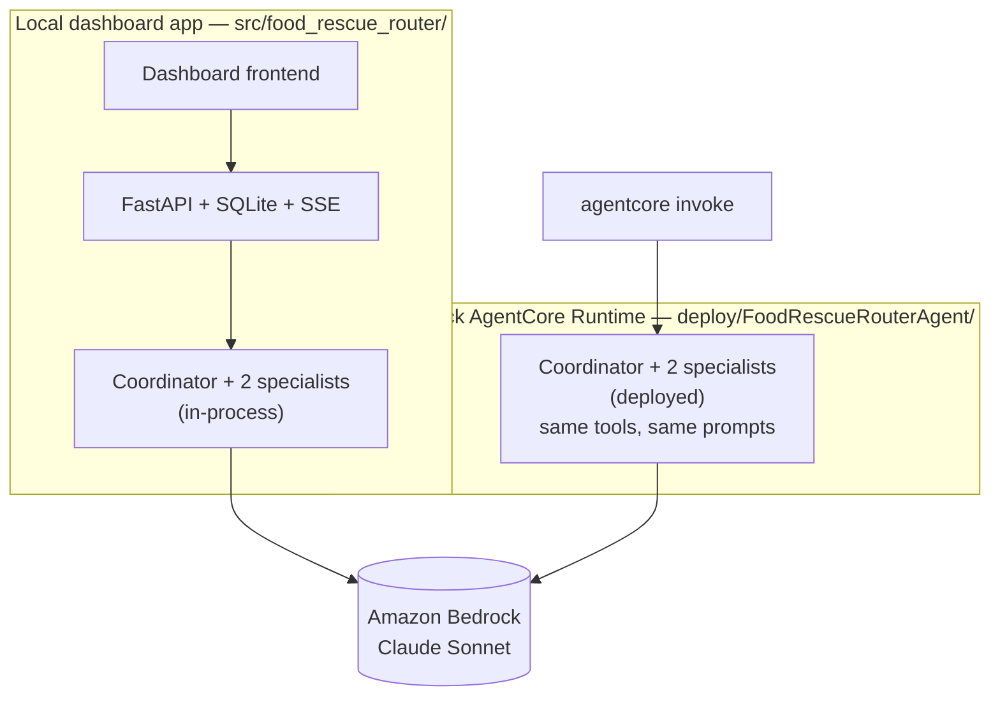

# Architecture

## Problem

Surplus food from grocers and restaurants goes to waste because matching it to a food
bank with real need, and a volunteer driver who can move it before it expires, is
normally done by an overworked human coordinator on the phone and in spreadsheets.
Good matches get missed or made too late.

## Who this is for

A city-scale food-rescue coordinating network (the kind of role organizations like
food rescue alliances or community food-bank networks already fill) — specifically
the **donor** (grocer/restaurant), the **food bank**, and the **volunteer driver**,
three distinct parties who all benefit when a donation is routed well. This is a
**Good Neighbor Agent**: the win is measured at the community/network level, not one
person's productivity.

> This build uses a synthetic-but-realistic dataset (fictional donors, food banks,
> and drivers) rather than a real partner org's data — there is no live data source
> wired in yet.

## Autonomous flow — multi-agent delegation

The routing logic is a **coordinator agent that delegates to two specialist agents**,
each a separate Strands `Agent` wrapped as a `@tool` (the "agents-as-tools" pattern) —
not one agent calling two lookup functions. The coordinator never queries food bank or
driver data itself; it asks a specialist, who independently reasons over live data and
answers.

The coordinator's system prompt requires consulting both specialists before ever
calling `create_match` or `escalate_donation` — it cannot skip straight to a decision,
and it must always end by calling one of those two terminal actions. Every tool call
(the specialists' lookups, and the coordinator's final action) is a real read or write
against shared SQLite state. `create_match` writes three distinct notifications (one
per party) and publishes to the SSE event bus, which pushes the update to the
dashboard the instant it happens.

## Components

| Component | Tech | File |
|---|---|---|
| Coordinator + specialist agents | Strands Agents SDK (agents-as-tools), Amazon Bedrock (Claude) | `src/food_rescue_router/agent.py`, `tools.py`, `model.py` |
| State + live event bus | SQLite, asyncio pub/sub | `src/food_rescue_router/data_store.py` |
| Synthetic seed data (with real Austin, TX coordinates) | Python | `src/food_rescue_router/seed_data.py` |
| API | FastAPI (`POST /donations`, `GET /state`, `GET /events` SSE) | `src/food_rescue_router/api.py` |
| Dashboard | Vanilla HTML/JS + Tailwind, Leaflet map, marked.js + DOMPurify | `frontend/index.html` |

`POST /donations` accepts a new offer, persists it, and synchronously runs the
coordinator to completion. `GET /state` returns the full current state for the
dashboard's initial load; after that, `GET /events` (Server-Sent Events) pushes every
activity/match/escalation the instant it happens, so the donor/food-bank/driver panels,
the activity feed, and the map's route animation update live instead of waiting on a
poll interval. A 15-second poll remains as a fallback in case the SSE connection drops.

## Model

`strands.models.BedrockModel` pointed at a Claude Sonnet inference profile
(`us.anthropic.claude-sonnet-4-6` by default, configurable via `BEDROCK_MODEL_ID`)
in `us-east-1` (configurable via `AWS_REGION`). Requires AWS credentials with Bedrock
model access.

## Deployment topology

The same multi-agent system (coordinator + Matching Specialist + Logistics
Specialist) exists in two places, sharing identical tools and prompts: the local
dashboard app calls it in-process, and it's also deployed standalone to AWS Bedrock
AgentCore Runtime, invokable independently of the dashboard.

See [docs/deploy-agentcore.md](deploy-agentcore.md) for the live runtime ARN and how
to redeploy.
